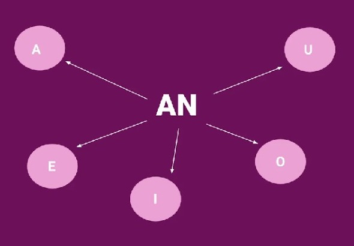
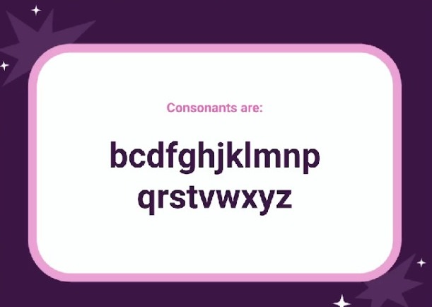

# A and An

you will learn "A" and "and" with vowels and cosonants

## Singular nouns 

"A" and "an" refer to only one person, place or thing, or noun

## An

"An" is the article we use with vowels

## A

"A" is the article we use with consonants

## Exceptions

"An" exceptions.

- ~~An~~ A university 
- ~~An~~ A username

## It's your turn!

Answer

## Extra

Extra note

